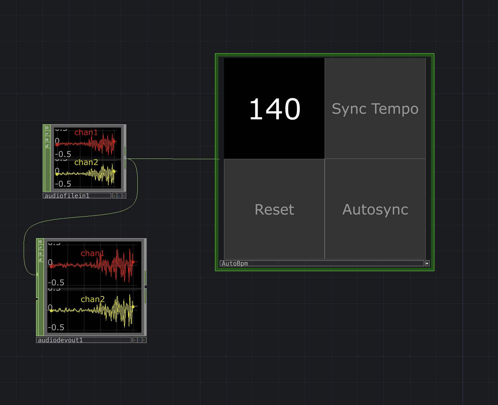

# Auto BPM Sync for TouchDesigner

Automatic BPM detection and synchronization for TouchDesigner, powered by a Temporal Convolutional Network trained on 7,000+ tracks spanning jazz, techno, footwork, and more.

## Setup

1. Open the project and enter the `AutoBpm` container.
2. Locate the `tdPyEnvManager` palette component.
3. In the parameters panel, create a new Python environment:
   - Mode: Python vEnv
   - Source: `requirements.txt`
4. If some modules aren't found in `script1_callbacks`, you might have to pulse the Restart parameter in `tdPyEnvManager`
5. In the `script1` parameters panel, on the `BPM Detection Params` page, set Torch Device to be either `mps`, `cpu`, or `cuda`

## Usage

After the environment is created, the system runs automatically inside the `AutoBpm` container.

### Controls

- Reset (Momentary): Restarts the BPM detector.
- Sync Tempo (Momentary): Sets the project file's tempo to the currently detected BPM.
- Autosync (Toggle Down): When enabled, the project file's tempo automatically syncs to the detected BPM.