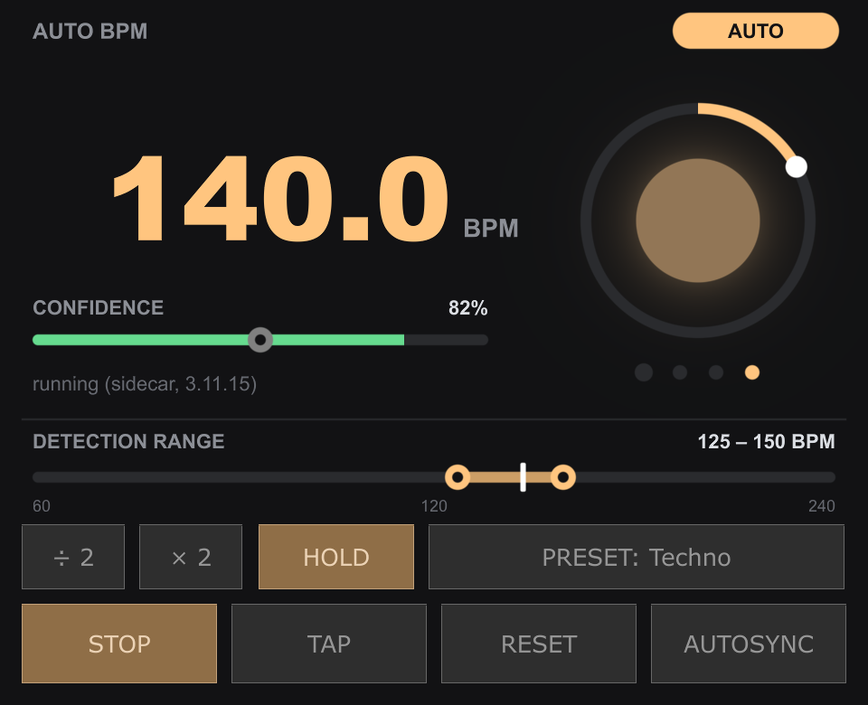
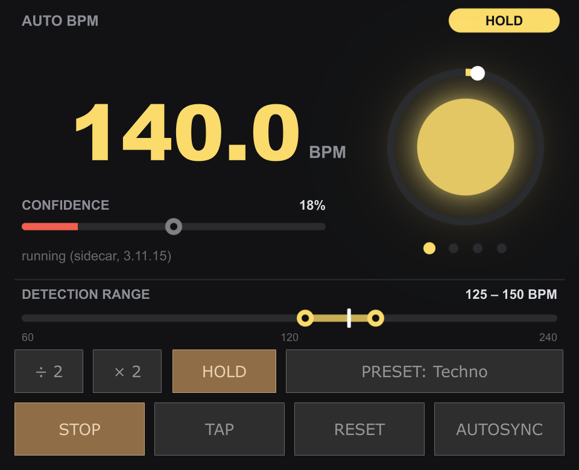

# AutoBPM for TouchDesigner

Real-time tempo detection for TouchDesigner. Feed it audio and it gives you the **BPM**,
how **confident** it is, and a **beat** and **phase** to drive visuals with. A control panel
covers starting and stopping detection, tap tempo, halving or doubling, genre ranges
and holding the tempo through breakdowns.



It runs the [TempoNet](#credits) neural network at roughly 60x realtime on a single CPU
core, in a separate process by default, so it works with whatever Python you already
have and cannot crash TouchDesigner.

- **Tempo, confidence, beat and phase** as CHOP channels
- **Control panel** with the readout, a confidence meter, a beat ring and all controls
- **Detection range**: tell it the genre, and 87 BPM drum & bass becomes 174
- **Hold**: keeps the last confident tempo through breakdowns and blends
- **Tap tempo** with the button, the space bar or MIDI, which also sets where the beat falls
- **÷2 / ×2** for when the detector counts half or double time
- **Autosync** of TouchDesigner's timeline tempo, gated on confidence
- A **command line** for analysing files and live inputs outside TouchDesigner

## Demo

[](https://youtu.be/KuaTeZwz58E)

Watch it [on YouTube](https://youtu.be/KuaTeZwz58E).

## Requirements

- TouchDesigner 2025 (built and tested on 2025.30060; earlier versions are untested)
- Python 3.9 or later with `torch`, `torchaudio`, `numpy` and `soundfile`; any venv or
  conda environment will do (see [Python environments](#python-environments))
- macOS or Linux. Tested on macOS on Apple Silicon. Windows is not supported yet: the
  default runtime talks to its detector process over a Unix socket.

## Installation

**1. Get the code and a Python environment.** With [uv](https://docs.astral.sh/uv/):

```bash
git clone https://github.com/parsakaz/td-autobpmdetector
cd td-autobpmdetector
uv venv --python 3.11
uv pip install -e '.[live]'
```

Or with plain pip:

```bash
python3 -m venv .venv
.venv/bin/pip install -e '.[live]'
```

Check that it works:

```bash
uv run tdautobpm doctor                        # which environments can run it
uv run tdautobpm analyze test_tracks/yuqt.mp3  # tempo of a file
```

**2. Add the component to your TouchDesigner project.** Drag
`touchdesigner/AutoBpm.tox` into your network. Then:

1. Set **Repo Path** (on the component's *Auto BPM* page) to the folder you cloned. It
   can stay blank if your `.toe` is saved inside that folder.
2. Wire an **Audio Device In** CHOP (or any audio CHOP) into the component's input.
3. The control panel shows in the component's node viewer. To click on it, make the
   viewer active with the button at the node's bottom-right corner, or open the
   component in its own window (right-click, then **View...**).

It starts the detector by itself. After a few seconds of music the BPM appears.

To rebuild the component from source instead, run this in the textport:

```python
p = "/path/to/td-autobpmdetector/touchdesigner/build_component.py"
exec(open(p).read(), {"__file__": p, "PARENT": "/project1"})
```

That creates `/project1/AutoBpm` and saves `touchdesigner/AutoBpm.tox`. Rebuilding over an
existing component keeps its wiring and settings.

## Using it

Wire the component's output into a CHOP (a Null CHOP, say) and read these channels
from it:

| Channel | Meaning |
| --- | --- |
| `bpm` | the tempo (held while unsure, if Hold is on; times the multiplier) |
| `confidence` | how sure the detector is right now, 0-1 |
| `beat` | 1 for one sample on each beat, otherwise 0 |
| `phase` | 0-1 position within the current beat |

For example, feed `beat` into a Trigger CHOP to flash on every beat, or use `phase`
as a ramp that restarts on each beat. With **Autosync** on, TouchDesigner's own timeline tempo
follows the detector whenever confidence is above the threshold.

### The control panel

| Control | What it does |
| --- | --- |
| **Readout** | the tempo, coloured by mode: AUTO (orange), HOLD (yellow), TAP (blue), STOPPED (grey); also NO INPUT and ERROR |
| **Confidence** | red → amber → green. Drag the **knob** to set the confidence threshold used by Hold and Autosync |
| **Beat ring** | the arc is the phase, the centre pulses on each beat, the dots count beats in the bar |
| **Detection range** | drag the handles, or pick a genre under **PRESET**. The white mark is what the detector currently hears |
| **÷ 2 / × 2** | halve or double the output tempo |
| **HOLD** | hold the last confident tempo while confidence is low |
| **START / STOP** | switch detection on or off. Off stops the detector process entirely |
| **TAP** | tap tempo, see below. The **space bar** taps too while the panel has focus (click it first) |
| **RESET** | forget everything heard so far and start analysing afresh |
| **AUTOSYNC** | keep TouchDesigner's timeline tempo in sync |

Every control is also a parameter on the component's *Auto BPM* page, so you can
drive them from MIDI, OSC or other operators.

### Detection range and presets

The detector often gets the pulse right but the speed wrong by a factor of two: drum &
bass at 174 comes out as 87. Tell it what's playing and it picks the right one. Only
tempos whose double or half falls in the range can win, and the result is reported
inside the range.

Music that doesn't fit the range shows confidence near zero, so Hold and Autosync
ignore it. The range only corrects factors of two. A tempo heard at 3:2 (110 as 165,
say) is a different kind of mistake, which the low confidence at least reveals.

The **PRESET** menu is read from [`touchdesigner/presets.csv`](touchdesigner/presets.csv),
a plain list you can edit:

```
Name,Lowest BPM,Highest BPM
House,120,128
Drum & Bass,165,180
```

Open it in any text editor, add or change lines, and save. The menu updates straight
away. Lines starting with `#` are notes. Files saved from Excel or Numbers work too,
including ones that use semicolons or decimal commas. A line that can't be read is
reported in the textport with its line number, and the rest still loads. To keep your
presets elsewhere, point the **Presets File** parameter at your own file.

### Hold



When confidence drops below the threshold (the knob on the confidence meter), in a
breakdown or a long blend, `bpm` keeps the last tempo that was above it instead of
wandering. The first confident reading afterwards takes over again. `confidence` always
reports the current value, and the white mark on the range strip shows what the
detector hears meanwhile. Until there has been a confident tempo there is nothing to
hold, so the first readings pass straight through.

### Tap tempo

Tap along with the TAP button, the space bar or the **Tap Tempo** pulse.

- **One tap** only moves the beat onto your tap. The detector knows how fast the music
  is but not where the beat falls, so this lines `beat` and `phase` up with it.
- **Two or more taps** set the tempo, reset ÷2/×2, and switch detection off so your
  tempo stays. Press START to hand back to the detector; with Hold on, your tempo stays
  until the detector is confident of its own.

## Parameters

| Parameter | Default | |
| --- | --- | --- |
| Active | on | detection on or off (START / STOP) |
| Runtime | Sidecar process | where the model runs; see [Runtimes](#runtimes) |
| Repo Path | blank | the cloned folder; blank finds it when the project is inside it |
| Python Env | blank | interpreter, venv, conda env path or conda env name; blank auto-detects |
| Torch Device | CPU | CPU, MPS (Apple GPU) or CUDA |
| Update Rate (Hz) | 4 | how often a new estimate arrives |
| Estimator | Local mean | how the estimate is read off the model's output |
| Smoothing | 0.9 | how much each estimate leans on the previous ones |
| Reset Every (s) | 5 | how often accumulated evidence is cleared; 0 never clears it |
| Lock At Confidence | 0 | stop clearing once this confident; 0 disables |
| Range Min / Max (BPM) | 60 / 240 | the detection range |
| Tempo Multiplier | 1 | ÷2 / ×2, from 0.25 to 4 |
| Reset, Tap Tempo, Half Tempo, Double Tempo | | pulses, same as the panel's buttons |
| Restart Detector | | pulse: restart the detector process |
| Sync Tempo | | pulse: set the timeline tempo once |
| Autosync | off | keep the timeline tempo in sync |
| Confidence Threshold | 0.5 | used by Hold and Autosync |
| Hold Below Threshold | on | Hold |
| Presets File | blank | blank uses `touchdesigner/presets.csv` |
| Status | | what the component is doing, or why it isn't |

Changing the detector's settings or the range takes effect immediately, without
restarting it or losing what it has heard.

## Troubleshooting

Ask the component what it sees:

```python
op('/project1/AutoBpm').Diagnose()
```

It prints the environment in use, what is arriving on the input and how loud it is,
and the detector's state.

- **NO INPUT**: nothing audio-rate is wired in. Connect an Audio Device In CHOP.
- **ERROR: could not find the td-autobpmdetector checkout**: set Repo Path.
- **ERROR about the environment**: run `tdautobpm doctor` and point Python Env at an
  environment it marks `sidecar: yes`.
- **The tempo is double or half**: set a detection range, or press ÷2 / ×2.
- **Pressing START freezes TouchDesigner briefly**: the detector process is loading the
  model, which takes about a second.

## Python environments

`Python Env` in TouchDesigner, or `TDAUTOBPM_PYTHON` everywhere else, accepts:

- a path to a Python interpreter
- a venv directory
- a conda environment directory
- a bare conda environment **name**

When it is blank, the order is `TDAUTOBPM_PYTHON`, then `$CONDA_PREFIX`, then
`$VIRTUAL_ENV`, then the project's `.venv`.

`tdautobpm doctor` lists every environment it can find and says, for each, whether it
can run the detector in-process, as a sidecar, or not at all:

```
[conda:myenv]
  /Users/you/miniconda3/envs/myenv/bin/python3
      CPython 3.12.11 arm64  [conda]
      torch, torchaudio, numpy, soundfile
  in-process: no  - host is Python 3.11.15 (cp311), environment is Python 3.12.11 (cp312);
                    compiled extensions are not interchangeable across minor versions
  sidecar:    yes
```

### Runtimes

| | Sidecar (default) | In-process |
| --- | --- | --- |
| Where the model runs | a separate process | inside TouchDesigner |
| Environment must match TouchDesigner's Python | no | yes: same minor version and architecture |
| A crash in torch takes TouchDesigner down | no | yes |
| Extra latency | one audio block | none |

The sidecar is the default because any Python 3.9+ environment works with it, whatever
TouchDesigner ships. It exits when TouchDesigner stops it, quits or crashes.

## Command line

```
tdautobpm analyze FILE...   # tempo of audio files; --json, --range LO-HI
tdautobpm listen            # live from a system input; --device-index N, --range LO-HI
tdautobpm devices           # list input devices
tdautobpm serve             # run the detector server by hand
tdautobpm doctor            # diagnose Python environments
```

## How it works

TempoNet, a small causal temporal convolutional network (about 74k parameters), turns a
few seconds of mel spectrogram into a probability for every tempo from 60 to 200 BPM.
The engine smooths those over time, reads the estimate off near the most likely tempo,
and reports the probability mass around it as the confidence. Audio arrives at the
host's sample rate and is resampled as a continuous stream, so block boundaries leave no
artefacts that the model could mistake for a rhythm.

The model estimates *how fast*, not *where the beat is*. `beat` and `phase` run freely at
the detected tempo and are aligned by Reset or a tap: treat `beat` as a metronome
running at the right speed, not as an onset detector.

On synthetic click tracks the estimate is within 1 BPM whenever confidence is above
about 0.5, and confidence is low in the cases it gets wrong, which is why Hold and
Autosync gate on it.

## Development

```bash
uv pip install -e '.[dev,live]'
uv run pytest
```

The TouchDesigner component is generated by `touchdesigner/build_component.py` rather
than edited by hand, so that it can be reviewed and diffed; `AutoBpm.tox` is its output.
The component's logic lives in `touchdesigner/AutoBpmExt.py`. Both run inside
TouchDesigner's Python, so they may only import the standard library at module level,
and must stay ASCII; the tests check both.

## Credits

The tempo model is **TempoNet** by **shhhum**, from
[tdautobpmsync](https://github.com/shhhum/tdautobpmsync): its architecture
(`src/tdautobpm/model.py`), the trained weights (`models/temponet_ckpt.pt`, trained on
over 7,000 tracks), the original streaming inference that `src/tdautobpm/engine.py` is
derived from, and the demo track in `test_tracks/`. If you use this project, please cite
it too (see [`CITATION.cff`](CITATION.cff)):

> shhhum. *tdautobpmsync: Automatic BPM detection and synchronization for
> TouchDesigner.* 2026. https://github.com/shhhum/tdautobpmsync

tdautobpmsync has no licence, so these files are not covered by this project's MIT
licence.

## License

MIT, for this project's own code; see [LICENSE](LICENSE) and [Credits](#credits) for what
it does not cover.
